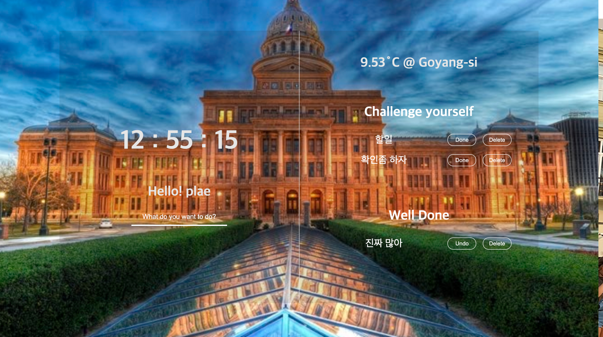
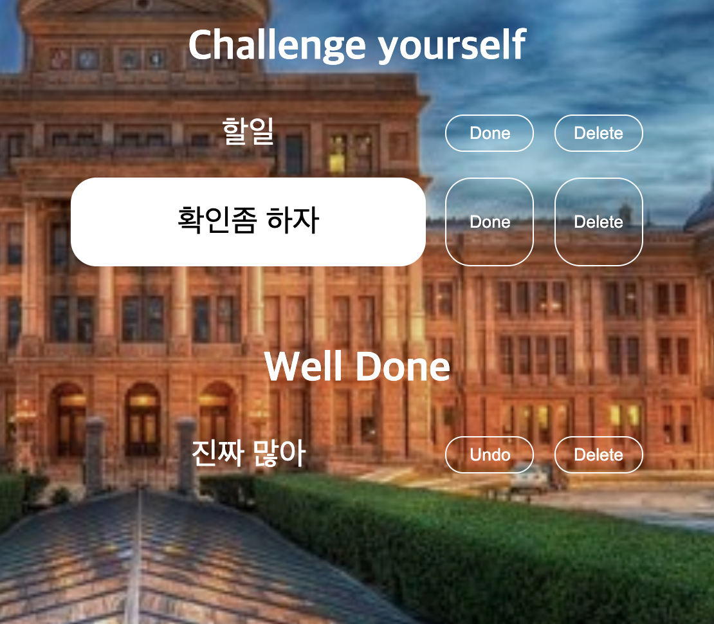
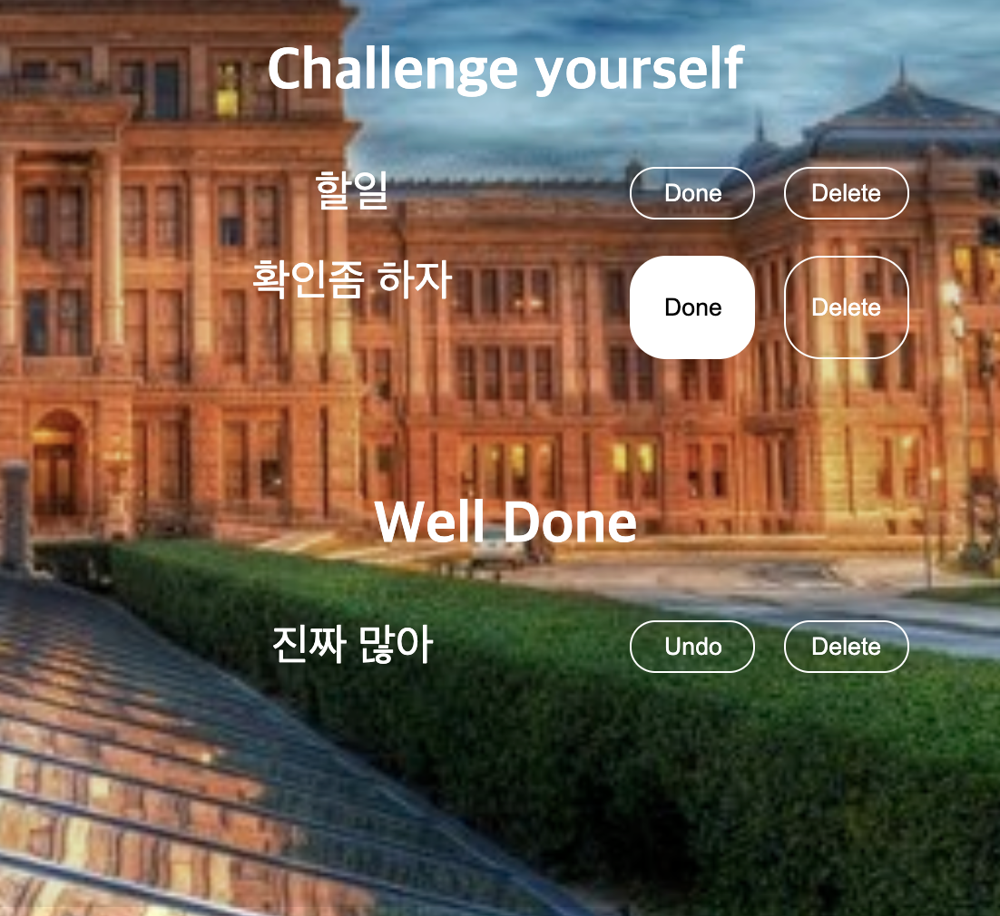

# MomentumClone

## Result

- Full Screen
  </img> 

- TodoList
  </img> 
  </img> 

## Function definition

- random()을 이용해 배경 이미지 무작위 선정
- setInterval() + new Date()를 이용한 실시간 시간 출력
- form["submit"]을 이용한 이름 입력 및 로컬 스토리지 저장
- 할 일을 입력받아 로컬 스토리지에 저장
- 버튼을 이용해 한 일 and 할 일 토글 가능
- 버튼을 이용해 할 일 and 할 일 삭제 가능
- Geo API를 이용해 위치 정보와, 이를 활용한 날씨 정보를 출력
